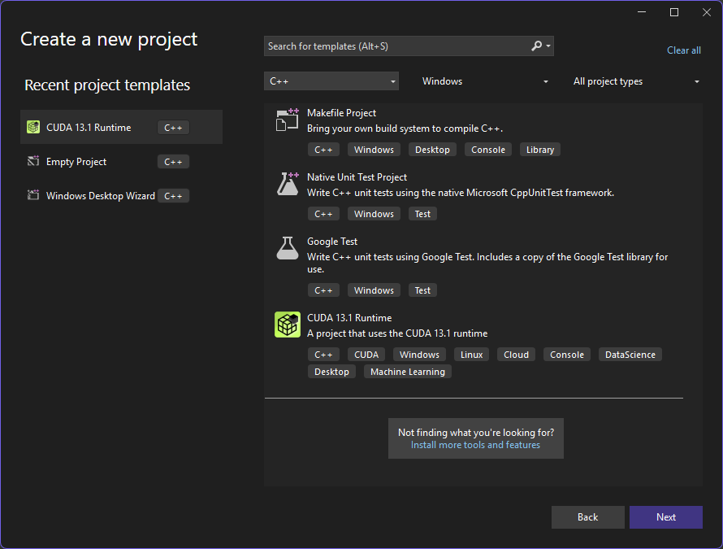
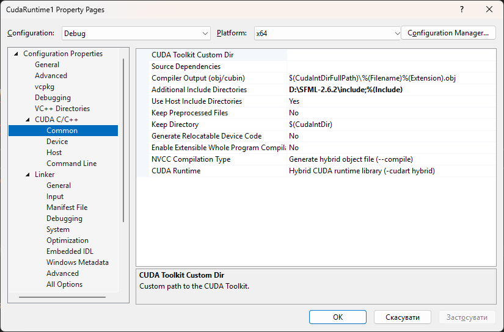
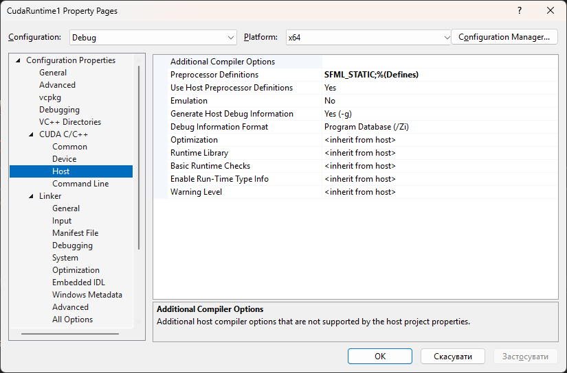
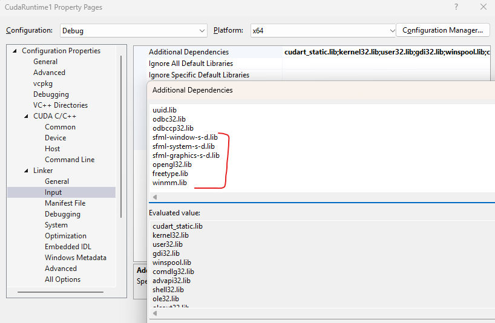

# CUDA GoL

## Installation guide

1) Install CUDA. Use https://docs.nvidia.com/cuda/cuda-quick-start-guide/index.html for example for quick start.
2) Ensure that you use Visual Studio 2022, as Visual Studio 2026 is not supported yet.
3) You'll need [CUDA capable GPU](https://developer.nvidia.com/cuda/gpus).
4) Install [SFML 2.6.2](https://www.sfml-dev.org/tutorials/2.6/start-vc.php). Some C++17 features are not supported yet by CUDA, so it's better to use older version over SFML 3.
5) Create CUDA Runtime Template project.

6) Add SFML dependencies (in my case I linked statically)
- 
- 
- 
- 
